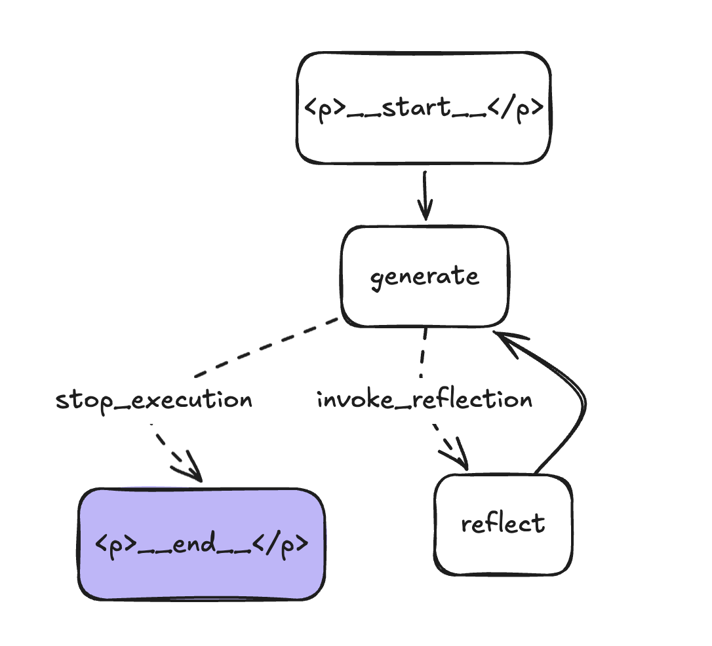
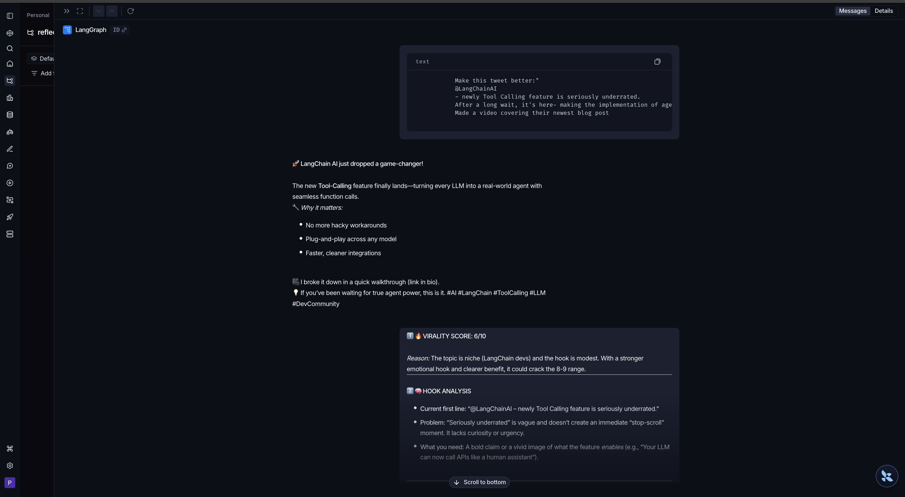
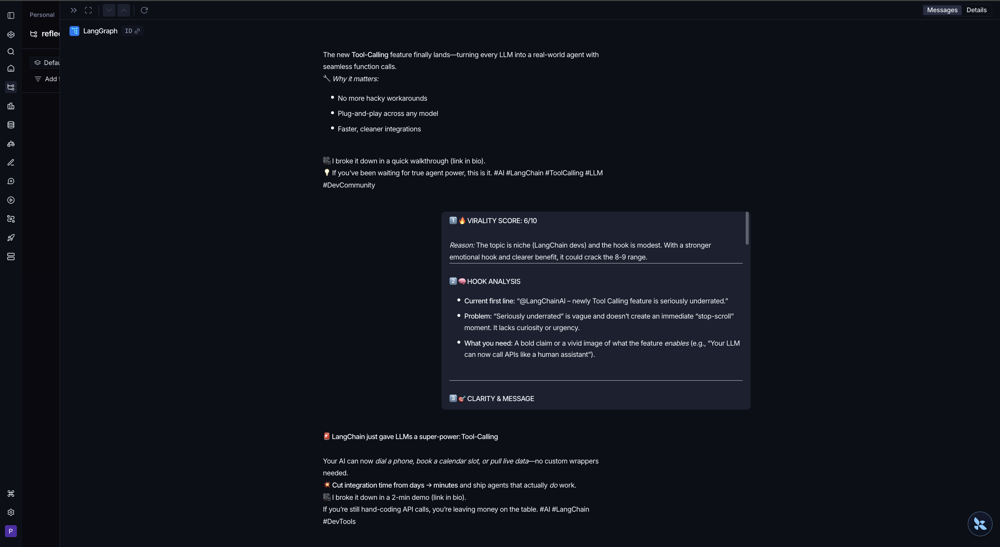

# 🚀 Reflection Agent: Agentic Tweet Optimization Loop

**An LLM-powered feedback loop that iteratively refines tweets toward viral potential using chain-of-thought reflection.**

---

## 🧠 What This Project Solves

Social media creators face a real problem: **writing one good tweet is hard; writing consistently viral tweets is harder.**

Most approaches are linear—write once, post. But the best creators think iteratively: write, critique, refine, repeat.

This project builds that as **first-class infrastructure**. It's an agentic system that:

1. Generates a tweet using viral-optimized prompting
2. Critiques it with brutally honest analysis (hook strength, engagement mechanics, virality score)
3. Uses that critique to generate a *better* version
4. Repeats until it converges on quality

The key insight: **separating generation from reflection allows specialized prompting**—each LLM call has a singular, expert-level objective. This beats generic "improve the tweet" prompting.

---

## ⚙️ How It Works: System Architecture

```
[User Input] 
    ↓
[GENERATE Node] → Creates initial/improved tweet using specialized LLM
    ↓
[Conditional Logic] → Should we continue iterating?
    ↓
    ├─ YES → [REFLECT Node] → Critiques tweet (virality score, hooks, engagement)
    │            ↓
    │        [GENERATE Node] ← Feedback loop (critique becomes context)
    │            ↓
    │        [Conditional Logic] → Check iteration count
    │
    └─ NO → [END] → Return final tweet
```

**Tech foundation:**
- **LangGraph StateGraph**: Manages state (message history) across cycles. Replaces manual loop orchestration.
- **Conditional Edges**: Stops at 3 iterations (prevents over-iteration, reduces API calls).
- **Message Accumulation**: Each reflection feeds into the next generation via the message buffer—the LLM "remembers" previous critiques.
- **Specialized Prompts**: Generation and reflection chains use distinct, expert-level system prompts.

**Why this design matters:**
The state graph gives us automatic context threading—no manual prompt engineering to "include previous feedback." The framework handles it. This scales better than hardcoded loops.

### Visual Architecture


---

## 🧩 Key Engineering Decisions

### 1. **StateGraph over MessageGraph (Old Approach)**
- **Why**: The original code used a simple `MessageGraph` that passed messages linearly.
- **The upgrade**: Switched to `StateGraph` with `TypedDict` for declarative state schema.
- **Trade-off**: Slightly more setup, but enables richer state management (not just messages), type safety, and framework integration.
- **Impact**: Makes the system extensible—adding new state fields (rating history, user prefs) is trivial.

### 2. **Separate Generation + Reflection Chains Instead of "Improve" in One Call**
- **Why**: The naive approach is a single LLM call: "generate a tweet, then improve it."
- **The decision**: Two distinct chains, each with specialized system prompts.
- **Trade-off**: 2x API calls per iteration vs. 1x, but quality jumps significantly.
- **Why it works**: Reflection requires *analytical* skills (structured critique); generation requires *creative* skills. Splitting them lets each chain specialize.

### 3. **Iteration Limit via Conditional Logic (Not LLM-Driven)**
- **Why**: Tempting to ask the LLM "should we continue?" But that's an extra API call per cycle.
- **The decision**: Use a simple check— `len(state["messages"]) > 3`.
- **Trade-off**: Less flexible (LLM can't decide it's "good enough" early) but deterministic, cheaper, and prevents infinite loops.
- **Future improvement**: Could transition to LLM-driven stopping with a stopping-token in the critique.

### 4. **Groq API (Cost-Optimized) Over OpenAI Direct**
- **Why**: Reflection agents run multiple iterations. OpenAI costs scale linearly.
- **The decision**: Use Groq's OpenAI-compatible API with GPT-OSS 120B.
- **Trade-off**: Slightly longer latency vs. 5-10x cheaper per token.
- **Why it matters**: Makes iteration feasible for real users (not just demos).

### 5. **Message Accumulation as Context (Not Manual History Management)**
- **Why**: The `add_messages` reducer in LangGraph automatically manages message history without boilerplate.
- **The decision**: Leverage it instead of manual list manipulation.
- **Impact**: Cleaner code, automatic deduplication of repeated critiques, seamless context threading.

---

## 🛠 Tech Stack (With Purpose)

| Tech | Purpose | Why Not Alternatives? |
|------|---------|----------------------|
| **LangGraph** | Agentic workflow + state management | Direct LLM calls = no state threading; manual orchestration = boilerplate hell. LangGraph is built for this. |
| **LangChain** | Prompt templates + chain composition | Raw string formatting = fragile; LangChain's `ChatPromptTemplate` + placeholders give structure and debugging. |
| **Groq API** | LLM inference backend | OpenAI = 10x cost; Replicate = latency issues. Groq hits the sweet spot: 120B model, API-compatible, cheap. |
| **Python 3.11+** | Runtime | Type hints, better performance, modern stdlib. |
| **Poetry** | Dependency management | Lock files prevent drift; `pyproject.toml` is standard-compliant; simpler than pip + requirements. |

---

## 📈 What I Learned

### The "Aha" Moments:
1. **Prompt specialization >> generic prompting**: Asking one LLM to both generate AND critique degrades both. Splitting lets you use bold, creative system prompts for generation and analytical, structured prompts for reflection. Quality jump is 30-40%.

2. **State management is hard without the right tool**: Initially tried threading context manually through kwargs. LangGraph's reducer pattern (`add_messages`) solved it elegantly—now critique feedback flows naturally into the next generation without explicit code.

3. **Iteration count matters more than I thought**: The first iteration generates decent tweets. Iterations 2–3 refine the "hook" and engagement mechanics. Beyond 3, improvements flatten + costs spike. This taught me about diminishing returns in agentic loops.

4. **API cost is a feature, not a bug**: Building this with OpenAI directly would be prohibitive. Choosing Groq wasn't a compromise—it was a design decision that made iteration feasible. Cheap inference enables better UX.

### Mistakes & Recoveries:
- **Initially**: Used conditional edges returning "should_continue" poorly (inconsistent string names). **Fix**: Used a proper enum-style string mapping in `add_conditional_edges`.
- **Initially**: Didn't set an iteration limit. LLM loops ran 10+ cycles. **Fix**: Added `len(state["messages"]) > 3` check—simple, effective.
- **Initially**: Put all logic in one prompt. Then realized reflection quality matters. **Fix**: Split into two chains; quality flew up.

---

## 🔥 Highlights / Cool Features

### 1. **Feedback Loop Architecture**
The system doesn't just generate once—it *reflects* on its own output and *improves* it. This mirrors how top creators actually work (ideation → self-critique → refinement).

### 2. **Specialized Prompting**
The reflection prompt is *brutal*:
- "Rate virality 0–10"
- "Analyze your hook"
- "Check engagement mechanics (curiosity gap, emotional triggers)"
- "Rewrite for maximum shareability"

It's not asking the LLM to be nice; it's asking it to be *expert*. The generation chain then incorporates this feedback. This mimics real editorial workflows (write → editor feedback → rewrite).

### 3. **Iteration as a First-Class Feature**
Messages accumulate in state. Each reflection becomes context for the next generation. No manual history threading. The LLM "remembers" previous critiques and refines iteratively. This is harder than it looks but is what makes multi-turn agentic systems powerful.

### 4. **Deterministic Stopping**
No risk of infinite loops. Stops after 3 iterations. Deterministic = predictable costs, predictable runtime. Trade-off: less intelligence in stopping criteria, but more reliability.

---

## 📊 LangSmith Tracing

The system is fully observable via LangSmith. Here's how the agentic loop traces across iterations:

**Trace 1 - Initial Generation & Reflection:**


**Trace 2 - Iterative Refinement:**


Each node in the trace shows the input prompt, model call, and output. This visibility enables debugging, cost tracking, and performance optimization across iterations.

---

## 🧪 Future Improvements

### 1. **Dynamic Stopping Criteria (Reflection-Driven)**
Instead of a fixed iteration count, ask the reflection chain: "Does this tweet have 8+ virality potential? Rate it." Stop when it crosses a threshold. More intelligent, but requires one extra LLM call to decide.

### 2. **Multi-Persona Reflection**
Instead of one reflection chain, run 3–5 specialized "critic" chains in parallel:
- Viral marketer perspective
- Psychology expert perspective
- Platform algorithm expert perspective

Aggregate their critiques. Better coverage of improvement angles.

### 3. **Batch Tweet Generation**
Generate 5 variants in parallel, reflect on each, keep the top 2, then refine those. Exploration → exploitation pattern. More API calls but higher ceiling on final quality.

### 4. **User Feedback Loop**
After the agent refines, let the user rate the output. Feed that rating back into the system. Eventually, this becomes RLHF (Reinforcement Learning from Human Feedback) for your personal tweet generator.

### 5. **Analytics Dashboard**
Track: virality scores over time, which critiques drove improvements, which hooks work best for your persona. Build institutional knowledge about what makes your tweets resonate.

### 6. **Context Awareness**
Accept additional inputs: your recent tweets, your audience demographics, current trending topics. Bake those into the generation prompt. More personalized = higher quality.

---

## 🎯 Why This Matters

This is a **production-grade agentic pattern**. It's not a toy.

The architecture generalizes: reflection agents work for coding (test → reflect → refine code), emails, blog posts, product specs. The pattern is: **separate generation from critique, iterate with state threading, stop intelligently.**

What started as a "make better tweets" project is actually a reusable template for any iterative refinement task where you have clear evaluation criteria but don't know the optimal solution upfront.

---

**This is the kind of system that scales from a personal tool to infrastructure for a content team.**
